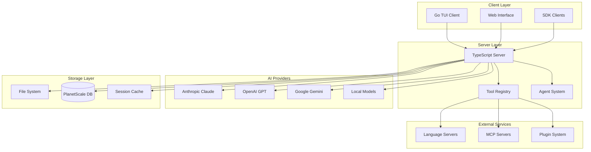
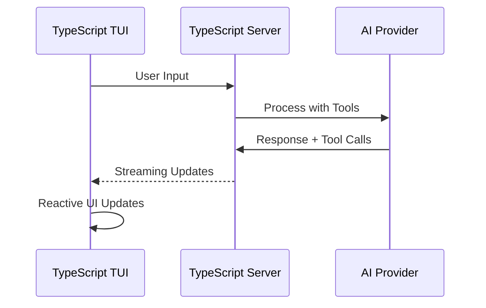
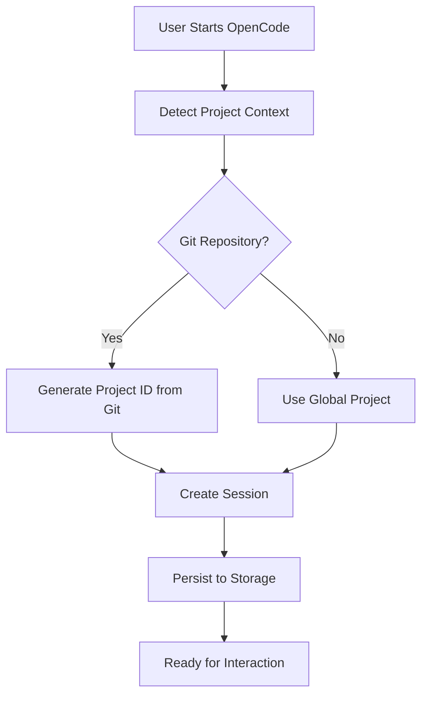
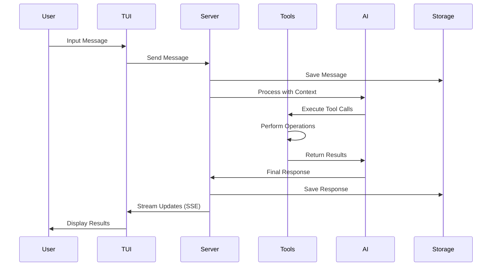
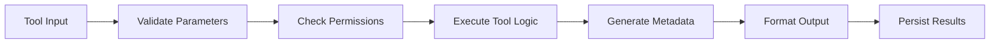

# 🏗️ Architecture Overview

OpenCode represents a sophisticated approach to AI-powered development tools, built on modern architectural principles and designed for scalability, extensibility, and developer experience.

---

## 🎯 Architectural Philosophy

### Core Design Principles

**1. Client-Server Separation**

- Clean separation between UI (Go TUI) and business logic (TypeScript server)
- Enables multiple client interfaces and remote operation
- Facilitates testing and independent scaling

**2. Provider Agnostic**

- No vendor lock-in to specific AI providers
- Unified interface for Anthropic, OpenAI, Google, and local models
- Future-proof against AI ecosystem changes

**3. Tool-Centric Architecture**

- Everything is a tool: file operations, bash commands, web requests
- Consistent interface for AI model interaction
- Extensible through plugins and MCP servers

**4. Event-Driven Communication**

- Real-time updates through Server-Sent Events (SSE)
- Reactive UI updates based on server state changes
- Efficient resource utilization

---

## 🏛️ High-Level Architecture



---

## 🔧 Core Components

### 1. TypeScript Server (`packages/opencode`)

**Purpose**: Central business logic and AI orchestration

**Key Responsibilities**:

- Session management and persistence
- AI provider integration and abstraction
- Tool execution and coordination
- Authentication and authorization
- Project and file management

**Architecture Patterns**:

- **Namespace-based organization**: `Tool.define()`, `Session.create()`, `Agent.list()`
- **Dependency injection**: Context-based service provision
- **Event-driven updates**: Bus system for real-time communication
- **Schema validation**: Zod for type-safe data handling

### 2. TypeScript TUI Client (`packages/opencode/src/cli/cmd/tui`)

**Purpose**: Rich terminal user interface

**Technology Stack**:

- **Framework**: OpenTUI (`@opentui/core` + `@opentui/solid`)
- **UI Library**: SolidJS - Fine-grained reactive UI framework
- **Rendering**: Custom terminal renderer (CliRenderer)
- **Components**: Dialog system, prompt input, autocomplete, toast notifications

**Key Features**:

- **Reactive rendering**: SolidJS-based component system
- **Real-time streaming**: Direct integration with server APIs
- **Rich interactions**: Syntax highlighting, auto-completion, history
- **Responsive design**: Adaptive layout for different terminal sizes
- **Keyboard management**: Custom keybinding system with `useKeyboard` hook

**Communication Flow**:



### 3. Tool System

**Architecture**: Plugin-based tool registry with consistent interface

**Built-in Tools**:

- **File Operations**: `read`, `write`, `edit`, `list`, `glob`
- **Search**: `grep` for content search across files
- **Execution**: `bash` for command execution with safety checks
- **Web**: `webfetch` for HTTP requests and web scraping
- **LSP Integration**: `lsp_diagnostics`, `lsp_hover` for code analysis
- **Task Management**: `task` for delegating to specialized agents

**Tool Interface**:

```typescript
export interface Tool.Info<Parameters, Metadata> {
  id: string
  init: () => Promise<{
    description: string
    parameters: Parameters
    execute(args: Parameters, ctx: Context): Promise<{
      title: string
      metadata: Metadata
      output: string
    }>
  }>
}
```

### 4. Agent System

**Purpose**: Specialized AI agents for different use cases

**Agent Types**:

- **General**: Research, search, multi-step tasks
- **Build**: Code generation and modification
- **Plan**: High-level architecture and planning

**Agent Configuration**:

```typescript
export const Agent.Info = {
  name: string
  description?: string
  mode: "subagent" | "primary" | "all"
  tools: Record<string, boolean>
  permission: {
    edit: Permission
    bash: Record<string, Permission>
    webfetch?: Permission
  }
  model?: { modelID: string, providerID: string }
}
```

---

## 🔄 Key Business Workflows

### 1. Session Creation and Management



### 2. AI Interaction Flow



### 3. Tool Execution Pipeline



---

## 🗄️ Data Architecture

### Storage Strategy

**File System Storage**:

- Session data and messages
- Project metadata and state
- Configuration files

**Database Storage** (PlanetScale):

- User authentication data
- Shared session metadata
- Usage analytics and billing

**In-Memory Caching**:

- Active session state
- LSP client connections
- Tool execution context

### Data Flow Patterns

**1. Session Persistence**:

```typescript
// Hierarchical storage structure
["session", projectID, sessionID] → Session.Info
["message", sessionID, messageID] → Message.Info
["part", messageID, partID] → Part.Info
```

**2. Project Context**:

```typescript
// Project identification and caching
Project.fromDirectory(directory) → Project.Info
Instance.provide(directory, callback) → Context
```

---

## 🔌 Extension Architecture

### Plugin System

**JavaScript Plugins**:

```typescript
export type Plugin = (input: PluginInput) => Promise<Hooks>

interface PluginInput {
  client: OpencodeClient
  project: Project
  directory: string
  worktree: string
  $: BunShell
  Tool: { define(id: string, init: any): any }
  z: ZodInstance
}
```

### MCP (Model Context Protocol) Integration

**Server Registration**:

```json
{
  "mcp": {
    "weather": {
      "type": "local",
      "command": ["opencode", "x", "@h1deya/mcp-server-weather"]
    }
  }
}
```

**Transport Support**:

- **Stdio**: Local process communication
- **SSE**: Server-Sent Events for web integration
- **HTTP**: RESTful API integration

---

## 🌐 Cloud Infrastructure

### Cloudflare Workers Architecture

**API Worker** (`infra/app.ts`):

- RESTful API endpoints
- Durable Objects for real-time sync
- Edge computing for low latency

**Auth Worker** (`infra/cloud.ts`):

- OAuth flow management
- JWT token handling
- Provider authentication

**Web Interface**:

- SolidStart application
- Static asset serving
- Documentation hosting

### Database Design

**PlanetScale MySQL**:

- Branch-based development workflow
- Automatic scaling and backups
- Global edge distribution

---

## 🔒 Security Architecture

### Authentication Layers

**1. Provider Authentication**:

- OAuth flows for Claude Pro/Max
- API key management for OpenAI/Google
- GitHub Copilot token exchange

**2. Session Security**:

- Encrypted session storage
- Secure sharing mechanisms
- Permission-based tool access

**3. Tool Execution Safety**:

- Sandboxed bash execution
- Path traversal protection
- Resource usage limits

---

## 📊 Performance Considerations

### Optimization Strategies

**1. Lazy Loading**:

- LSP clients created on-demand
- Tool initialization deferred
- Plugin loading optimized

**2. Caching**:

- Project context caching
- Tool result memoization
- AI response streaming

**3. Resource Management**:

- Connection pooling for LSP
- Memory-efficient file handling
- Graceful degradation

---

## 🔮 Future Architecture Evolution

### Planned Enhancements

**1. Distributed Architecture**:

- Multi-node server deployment
- Load balancing and failover
- Horizontal scaling capabilities

**2. Enhanced Plugin System**:

- WebAssembly plugin support
- Sandboxed execution environment
- Plugin marketplace integration

**3. Advanced AI Integration**:

- Multi-modal input support
- Custom model fine-tuning
- Federated learning capabilities

---

*This architecture enables OpenCode to be both powerful and flexible, supporting current needs while being prepared for future growth and evolution.*
