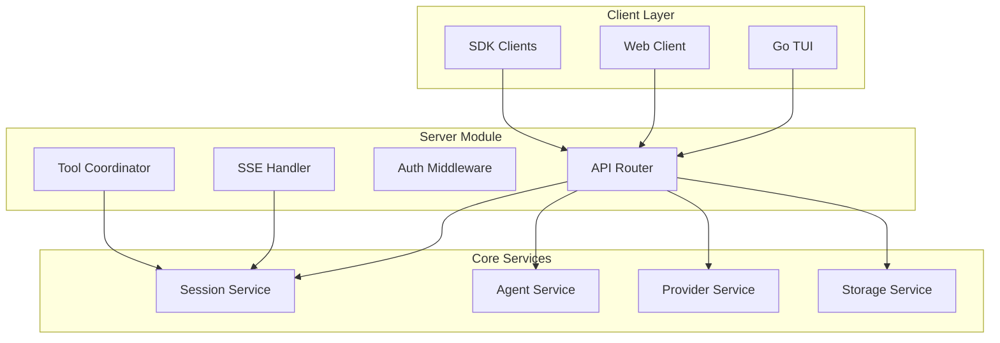
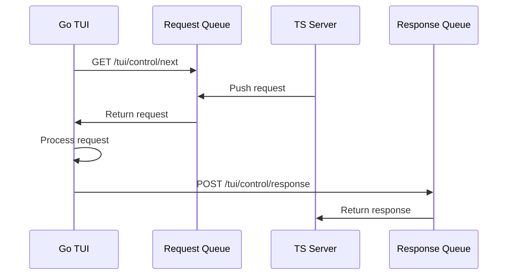
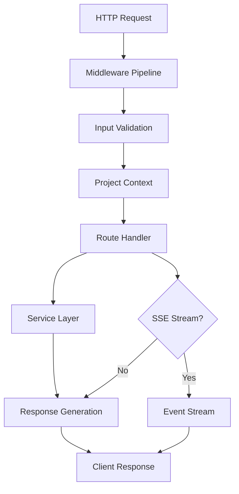

# 🖥️ Server Module - Core Business Logic Engine

The Server Module (`packages/opencode/src/server/`) forms the heart of OpenCode's architecture, providing the central API layer, business logic orchestration, and integration point for all system components.

---

## 🎯 Module Overview

### Primary Responsibilities

- **API Gateway**: RESTful API endpoints for all client interactions
- **Session Management**: Orchestrating AI conversations and tool executions
- **Real-time Communication**: Server-Sent Events (SSE) for live updates
- **Authentication & Authorization**: Security layer for all operations
- **Tool Orchestration**: Coordinating tool execution and result streaming
- **Provider Integration**: Abstracting AI provider differences

### Architecture Position



---

## 🔧 Core Components

### 1. Main Server Application (`server.ts`)

**Architecture Pattern**: Hono-based HTTP server with middleware pipeline

```typescript
export const App = new Hono()
  .onError((err, c) => {
    log.error("failed", { error: err })
    if (err instanceof NamedError) {
      return c.json(err.toObject(), { status: 400 })
    }
    return c.json(new NamedError.Unknown({ message: err.toString() }).toObject(), {
      status: 400,
    })
  })
  .use(async (c, next) => {
    // Request logging middleware
    const skipLogging = c.req.path === "/log"
    if (!skipLogging) {
      log.info("request", {
        method: c.req.method,
        path: c.req.path,
      })
    }
    const start = Date.now()
    await next()
    if (!skipLogging) {
      log.info("response", {
        duration: Date.now() - start,
      })
    }
  })
  .use(async (c, next) => {
    // Project context middleware
    const directory = c.req.query("directory") ?? process.cwd()
    return Instance.provide(directory, async () => {
      return next()
    })
  })
```

**Key Features**:
- **Error Handling**: Centralized error processing with structured responses
- **Request Logging**: Comprehensive request/response logging with timing
- **Context Injection**: Automatic project context provision for all requests
- **Middleware Pipeline**: Extensible middleware architecture

### 2. API Endpoint Architecture

**Session Management Endpoints**:
```typescript
// Session lifecycle
.get("/session", async (c) => {
  const sessions = await Session.list()
  return c.json(sessions)
})

.post("/session", async (c) => {
  const body = c.req.valid("json")
  const session = await Session.create({
    id: body.id,
    parentID: body.parentID,
    title: body.title,
  })
  return c.json(session)
})

.delete("/session/:id", async (c) => {
  const id = c.req.valid("param").id
  await Session.remove(id)
  return c.json(true)
})
```

**Message Processing Endpoints**:
```typescript
.post("/session/:sessionID/message", async (c) => {
  const sessionID = c.req.valid("param").sessionID
  const body = c.req.valid("json")
  
  const message = await Session.prompt({
    sessionID,
    messageID: body.messageID,
    model: body.model,
    agent: body.agent,
    tools: body.tools,
    parts: body.parts,
  })
  
  return c.json(message)
})
```

**Real-time Event Streaming**:
```typescript
.get("/event", async (c) => {
  return streamSSE(c, async (stream) => {
    const unsubscribe = Bus.subscribe((event) => {
      stream.writeSSE({
        data: JSON.stringify(event),
        event: event.type,
      })
    })
    
    stream.onAbort(() => {
      unsubscribe()
    })
    
    // Keep connection alive
    const keepAlive = setInterval(() => {
      stream.writeSSE({ data: "ping", event: "ping" })
    }, 30000)
    
    stream.onAbort(() => {
      clearInterval(keepAlive)
    })
  })
})
```

### 3. TUI Communication Bridge (`tui.ts`)

**Purpose**: Facilitates communication between Go TUI and TypeScript server

```typescript
interface Request {
  path: string
  body: any
}

const request = new AsyncQueue<Request>()
const response = new AsyncQueue<any>()

export async function callTui(ctx: Context) {
  const body = await ctx.req.json()
  request.push({
    path: ctx.req.path,
    body,
  })
  return response.next()
}

export const TuiRoute = new Hono()
  .get("/next", async (c) => {
    const req = await request.next()
    return c.json(req)
  })
  .post("/response", async (c) => {
    const body = await c.req.json()
    response.push(body)
    return c.json(true)
  })
```

**Communication Flow**:


---

## 🔄 Request Processing Pipeline

### 1. Request Lifecycle



### 2. Error Handling Strategy

**Structured Error Responses**:
```typescript
const ERRORS = {
  400: {
    description: "Bad request",
    content: {
      "application/json": {
        schema: resolver(
          z.object({
            data: z.record(z.string(), z.any()),
          }).openapi({ ref: "Error" })
        ),
      },
    },
  },
} as const
```

**Error Processing**:
```typescript
.onError((err, c) => {
  log.error("failed", { error: err })
  
  if (err instanceof NamedError) {
    return c.json(err.toObject(), { status: 400 })
  }
  
  return c.json(
    new NamedError.Unknown({ message: err.toString() }).toObject(),
    { status: 400 }
  )
})
```

### 3. Input Validation & Schema

**Zod-based Validation**:
```typescript
import { resolver, validator as zValidator } from "hono-openapi/zod"

.post("/session/:sessionID/message",
  describeRoute({
    description: "Send message to session",
    operationId: "session.message.create",
    responses: {
      200: {
        description: "Message processed successfully",
        content: {
          "application/json": {
            schema: resolver(MessageV2.Info),
          },
        },
      },
      ...ERRORS,
    },
  }),
  zValidator("param", z.object({
    sessionID: z.string(),
  })),
  zValidator("json", z.object({
    messageID: z.string().optional(),
    model: z.object({
      modelID: z.string(),
      providerID: z.string(),
    }),
    agent: z.string(),
    tools: z.record(z.boolean()),
    parts: z.array(Part.Input),
  })),
  async (c) => {
    const sessionID = c.req.valid("param").sessionID
    const body = c.req.valid("json")
    // Handler implementation
  }
)
```

---

## 🛠️ Tool Integration Architecture

### 1. HTTP Tool Registration

**Tool Registration Endpoint**:
```typescript
.post("/tool/register",
  zValidator("json", HttpToolRegistration),
  async (c) => {
    const registration = c.req.valid("json")
    await ToolRegistry.registerHttpTool(registration)
    return c.json({ success: true })
  }
)
```

**HTTP Tool Execution**:
```typescript
const executeHttpTool = async (
  registration: HttpToolRegistration,
  args: any,
  ctx: Tool.Context
): Promise<ToolResult> => {
  const response = await fetch(registration.callbackUrl, {
    method: "POST",
    headers: {
      "Content-Type": "application/json",
      ...registration.headers,
    },
    body: JSON.stringify({
      id: registration.id,
      args,
      context: {
        sessionID: ctx.sessionID,
        messageID: ctx.messageID,
        agent: ctx.agent,
      },
    }),
  })
  
  if (!response.ok) {
    throw new Error(`HTTP tool execution failed: ${response.statusText}`)
  }
  
  return await response.json()
}
```

### 2. Tool Execution Coordination

**Tool Execution Pipeline**:
```typescript
const executeTool = async (
  toolId: string,
  args: any,
  ctx: Tool.Context
): Promise<ToolResult> => {
  // 1. Find tool definition
  const tool = await ToolRegistry.get(toolId)
  if (!tool) throw new Error(`Tool not found: ${toolId}`)
  
  // 2. Validate permissions
  await Permission.check(toolId, ctx)
  
  // 3. Execute tool
  const result = await tool.execute(args, ctx)
  
  // 4. Stream updates
  Bus.publish(ToolEvents.Executed, {
    toolId,
    sessionID: ctx.sessionID,
    result,
  })
  
  return result
}
```

---

## 🔐 Security & Authentication

### 1. Authentication Middleware

**Auth Token Validation**:
```typescript
const authMiddleware = async (c: Context, next: Next) => {
  const authHeader = c.req.header("Authorization")
  if (!authHeader) {
    return c.json({ error: "Missing authorization header" }, 401)
  }
  
  const token = authHeader.replace("Bearer ", "")
  const user = await validateToken(token)
  
  if (!user) {
    return c.json({ error: "Invalid token" }, 401)
  }
  
  c.set("user", user)
  await next()
}
```

### 2. Permission System Integration

**Permission Checking**:
```typescript
.put("/auth/:id",
  zValidator("param", z.object({ id: z.string() })),
  zValidator("json", Auth.Info),
  async (c) => {
    const id = c.req.valid("param").id
    const info = c.req.valid("json")
    
    // Check if user has permission to set auth for this provider
    await Permission.check("auth", { provider: id })
    
    await Auth.set(id, info)
    return c.json(true)
  }
)
```

---

## 📊 Performance Optimizations

### 1. Connection Management

**Keep-Alive Strategy**:
```typescript
export function listen(opts: { port: number; hostname: string }) {
  const server = Bun.serve({
    port: opts.port,
    hostname: opts.hostname,
    idleTimeout: 0,  // Disable idle timeout for long-running connections
    fetch: App.fetch,
  })
  return server
}
```

### 2. Streaming Optimizations

**Efficient SSE Streaming**:
```typescript
.get("/event", async (c) => {
  return streamSSE(c, async (stream) => {
    // Efficient event filtering
    const unsubscribe = Bus.subscribe((event) => {
      // Only stream relevant events
      if (shouldStreamEvent(event, c.req.query("filter"))) {
        stream.writeSSE({
          data: JSON.stringify(event),
          event: event.type,
        })
      }
    })
    
    // Connection cleanup
    stream.onAbort(() => {
      unsubscribe()
    })
  })
})
```

### 3. Caching Strategy

**Response Caching**:
```typescript
const responseCache = new Map<string, { data: any; expires: number }>()

const cacheMiddleware = (ttl: number) => async (c: Context, next: Next) => {
  const key = `${c.req.method}:${c.req.path}:${c.req.query()}`
  const cached = responseCache.get(key)
  
  if (cached && cached.expires > Date.now()) {
    return c.json(cached.data)
  }
  
  await next()
  
  // Cache successful responses
  if (c.res.status === 200) {
    responseCache.set(key, {
      data: await c.res.clone().json(),
      expires: Date.now() + ttl,
    })
  }
}
```

---

## 🔍 Monitoring & Observability

### 1. Request Logging

**Structured Logging**:
```typescript
const log = Log.create({ service: "server" })

.use(async (c, next) => {
  const requestId = crypto.randomUUID()
  const start = Date.now()
  
  log.info("request.start", {
    requestId,
    method: c.req.method,
    path: c.req.path,
    userAgent: c.req.header("User-Agent"),
  })
  
  await next()
  
  log.info("request.complete", {
    requestId,
    status: c.res.status,
    duration: Date.now() - start,
  })
})
```

### 2. Health Checks

**Health Monitoring**:
```typescript
.get("/health", async (c) => {
  const health = {
    status: "healthy",
    timestamp: new Date().toISOString(),
    version: Installation.VERSION,
    uptime: process.uptime(),
    memory: process.memoryUsage(),
    connections: {
      active: getActiveConnections(),
      total: getTotalConnections(),
    },
  }
  
  return c.json(health)
})
```

---

## 🎯 Key Design Decisions

### 1. Why Hono Framework?

**Advantages**:
- **Performance**: Faster than Express.js with better TypeScript support
- **Edge Runtime**: Compatible with Cloudflare Workers
- **Type Safety**: Excellent TypeScript integration
- **Middleware**: Clean middleware architecture
- **OpenAPI**: Built-in OpenAPI specification generation

### 2. SSE vs WebSockets

**SSE Choice Rationale**:
- **Simplicity**: Easier to implement and debug
- **HTTP/2 Compatibility**: Better performance over HTTP/2
- **Automatic Reconnection**: Built-in browser reconnection
- **Firewall Friendly**: Works through corporate firewalls
- **One-way Communication**: Sufficient for OpenCode's needs

### 3. Request/Response Queue Pattern

**Benefits**:
- **Decoupling**: TUI and server can evolve independently
- **Reliability**: Built-in retry and error handling
- **Scalability**: Can handle multiple concurrent requests
- **Debugging**: Easy to inspect request/response flow

---

## 🔮 Future Enhancements

### Planned Improvements

1. **GraphQL Integration**: More flexible query capabilities
2. **WebSocket Support**: For bidirectional communication needs
3. **Rate Limiting**: Advanced rate limiting and throttling
4. **Metrics Collection**: Prometheus-compatible metrics
5. **Load Balancing**: Multi-instance deployment support

---

*The Server Module serves as the robust foundation that enables OpenCode's sophisticated AI-powered development workflows while maintaining high performance and reliability.*
