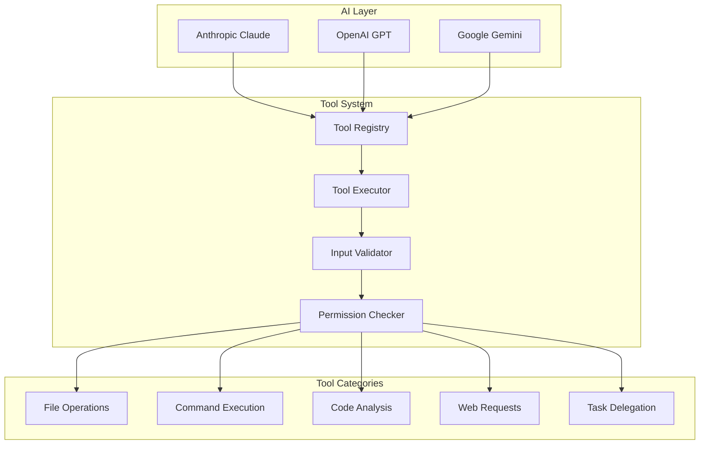
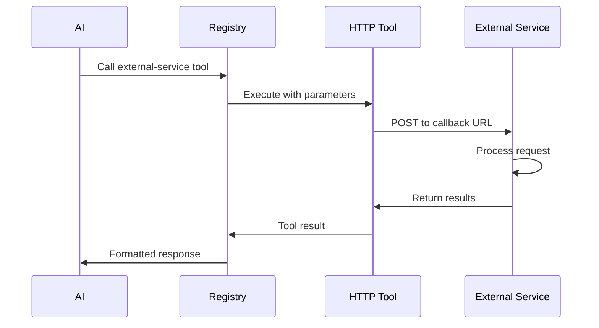

# 🔧 Tool System - Extensible AI Capabilities

The Tool System is OpenCode's most innovative architectural component, providing a unified interface for AI models to interact with the development environment. It transforms abstract AI requests into concrete actions while maintaining security and extensibility.

---

## 🎯 System Overview

### Core Philosophy

The Tool System embodies the principle that **"everything is a tool"** - from file operations to web requests, from code analysis to task delegation. This unified approach provides:

- **Consistent Interface**: All tools implement the same `Tool.Info` interface
- **Type Safety**: Full TypeScript inference for parameters and results
- **Extensibility**: Easy addition of new tools via plugins or HTTP callbacks
- **Security**: Fine-grained permission system for all operations
- **Composability**: Tools can be combined for complex workflows

### Architecture Position



---

## 🏗️ Core Architecture

### 1. Tool Definition Interface

**Universal Tool Contract**:
```typescript
export namespace Tool {
  export interface Info<Parameters extends StandardSchemaV1, Metadata> {
    id: string
    init: () => Promise<{
      description: string
      parameters: Parameters
      execute(
        args: StandardSchemaV1.InferOutput<Parameters>,
        ctx: Context,
      ): Promise<{
        title: string
        metadata: Metadata
        output: string
      }>
    }>
  }
  
  export type Context<M extends Metadata = Metadata> = {
    sessionID: string
    messageID: string
    agent: string
    callID?: string
    abort: AbortSignal
    extra?: { [key: string]: any }
    metadata(input: { title?: string; metadata?: M }): void
  }
}
```

**Tool Factory Function**:
```typescript
export function define<Parameters extends StandardSchemaV1, Result extends Metadata>(
  id: string,
  init: Info<Parameters, Result>["init"] | Awaited<ReturnType<Info<Parameters, Result>["init"]>>,
): Info<Parameters, Result> {
  return {
    id,
    init: async () => {
      if (init instanceof Function) return init()
      return init
    },
  }
}
```

### 2. Tool Registry Architecture

**Registry Structure**:
```typescript
export namespace ToolRegistry {
  // Built-in tools that ship with opencode
  const BUILTIN = [
    BashTool, EditTool, WebFetchTool, GlobTool, GrepTool,
    ListTool, PatchTool, ReadTool, WriteTool,
    TodoWriteTool, TodoReadTool, TaskTool, InvalidTool
  ]

  // Extra tools registered at runtime (via plugins)
  const EXTRA: Tool.Info[] = []

  // Tools registered via HTTP callback (via SDK/API)
  const HTTP: Tool.Info[] = []
  
  export function allTools(): Tool.Info[] {
    return [...BUILTIN, ...EXTRA, ...HTTP]
  }
}
```

**Provider-Specific Adaptation**:
```typescript
export async function tools(providerID: string, modelID: string) {
  const result = await Promise.all(
    allTools().map(async (t) => ({
      id: t.id,
      ...(await t.init()),
    })),
  )

  // OpenAI requires nullable instead of optional
  if (providerID === "openai" || providerID === "azure") {
    return result.map((t) => ({
      ...t,
      parameters: optionalToNullable(t.parameters as unknown as z.ZodTypeAny),
    }))
  }

  // Google Gemini has specific parameter requirements
  if (providerID === "google") {
    return result.map((t) => ({
      ...t,
      parameters: sanitizeGeminiParameters(t.parameters as unknown as z.ZodTypeAny),
    }))
  }

  return result
}
```

---

## 🔧 Built-in Tool Categories

### 1. File System Tools

**Read Tool** - File content retrieval with intelligent features:
```typescript
export const ReadTool = Tool.define("read", {
  description: "Read file contents with optional line range and syntax highlighting",
  parameters: z.object({
    filePath: z.string().describe("Absolute path to the file"),
    startLine: z.number().optional().describe("Start line (1-based)"),
    endLine: z.number().optional().describe("End line (1-based)"),
    maxLines: z.number().optional().describe("Maximum lines to read"),
  }),
  execute: async (args, ctx) => {
    const normalized = path.isAbsolute(args.filePath) 
      ? args.filePath 
      : path.join(Instance.directory, args.filePath)
    
    // Security check
    if (!Filesystem.isWithin(normalized, Instance.worktree)) {
      throw new Error("File access outside project boundary")
    }
    
    const { content, patch, diff } = await File.read(
      path.relative(Instance.directory, normalized)
    )
    
    // Apply line range if specified
    const lines = content.split('\n')
    const startIdx = (args.startLine || 1) - 1
    const endIdx = args.endLine ? args.endLine - 1 : lines.length - 1
    const selectedLines = lines.slice(startIdx, endIdx + 1)
    
    return {
      title: path.relative(Instance.worktree, normalized),
      metadata: {
        path: normalized,
        size: content.length,
        lines: lines.length,
        encoding: 'utf-8',
        hasGitDiff: !!diff,
        range: args.startLine || args.endLine ? { startLine: args.startLine, endLine: args.endLine } : undefined
      },
      output: selectedLines.join('\n') + (diff ? `\n\n--- Git Diff ---\n${diff}` : '')
    }
  }
})
```

**Write Tool** - Safe file writing with backup:
```typescript
export const WriteTool = Tool.define("write", {
  description: "Write content to a file with automatic backup",
  parameters: z.object({
    filePath: z.string().describe("Absolute path to the file"),
    content: z.string().describe("Content to write"),
  }),
  execute: async (args, ctx) => {
    const agent = await Agent.get(ctx.agent)
    await Permission.check("edit", agent.permission.edit)
    
    const normalized = path.isAbsolute(args.filePath)
      ? args.filePath
      : path.join(Instance.directory, args.filePath)
    
    // Create backup if file exists
    if (await Bun.file(normalized).exists()) {
      const backup = `${normalized}.backup.${Date.now()}`
      await Bun.write(backup, await Bun.file(normalized).text())
    }
    
    await Bun.write(normalized, args.content)
    await LSP.touchFile(normalized)
    
    return {
      title: `Wrote ${path.relative(Instance.worktree, normalized)}`,
      metadata: {
        path: normalized,
        size: args.content.length,
        lines: args.content.split('\n').length,
        backup: true
      },
      output: `Successfully wrote ${args.content.length} characters to file`
    }
  }
})
```

### 2. Command Execution Tools

**Bash Tool** - Secure command execution:
```typescript
export const BashTool = Tool.define("bash", {
  description: "Execute bash commands with security restrictions",
  parameters: z.object({
    command: z.string().describe("The command to execute"),
    timeout: z.number().describe("Timeout in milliseconds").optional(),
    description: z.string().describe("Clear description of what this command does"),
  }),
  execute: async (args, ctx) => {
    const agent = await Agent.get(ctx.agent)
    
    // Extract command name for permission checking
    const commandName = args.command.split(' ')[0]
    const permission = agent.permission.bash[commandName] || agent.permission.bash["*"]
    await Permission.check("bash", permission)
    
    // Security validations
    if (args.command.includes('..')) {
      throw new Error("Command references paths outside of project")
    }
    
    const proc = Bun.spawn({
      cmd: ["bash", "-c", args.command],
      cwd: Instance.directory,
      stdout: "pipe",
      stderr: "pipe",
      env: {
        ...process.env,
        PATH: process.env.PATH,
        // Restrict environment
        HOME: Instance.directory,
        PWD: Instance.directory,
      }
    })
    
    const timeout = args.timeout || 30000
    const timeoutId = setTimeout(() => proc.kill(), timeout)
    
    const result = await proc.exited
    clearTimeout(timeoutId)
    
    const stdout = await new Response(proc.stdout).text()
    const stderr = await new Response(proc.stderr).text()
    
    return {
      title: args.description,
      metadata: {
        command: args.command,
        exit: result,
        duration: Date.now() - start,
        cwd: Instance.directory
      },
      output: result === 0 
        ? stdout 
        : `Command failed with exit code ${result}\n${stderr}`
    }
  }
})
```

### 3. Code Analysis Tools

**LSP Diagnostics Tool** - Real-time code analysis:
```typescript
export const LspDiagnosticTool = Tool.define("lsp_diagnostics", {
  description: "Get language server diagnostics for a file",
  parameters: z.object({
    path: z.string().describe("Path to the file to analyze"),
  }),
  execute: async (args) => {
    const normalized = path.isAbsolute(args.path) 
      ? args.path 
      : path.join(Instance.directory, args.path)
    
    await LSP.touchFile(normalized, true) // Wait for diagnostics
    const diagnostics = await LSP.diagnostics()
    const fileDiagnostics = diagnostics[normalized] || []
    
    const formatted = fileDiagnostics.map(LSP.Diagnostic.pretty).join('\n')
    
    return {
      title: path.relative(Instance.worktree, normalized),
      metadata: {
        diagnostics: fileDiagnostics,
        errorCount: fileDiagnostics.filter(d => d.severity === 1).length,
        warningCount: fileDiagnostics.filter(d => d.severity === 2).length,
      },
      output: formatted || "No diagnostics found"
    }
  }
})
```

### 4. Task Delegation Tools

**Task Tool** - AI agent delegation:
```typescript
export const TaskTool = Tool.define("task", async () => {
  const agents = await Agent.list().then((x) => x.filter((a) => a.mode !== "primary"))
  const description = DESCRIPTION.replace(
    "{agents}",
    agents
      .map((a) => `- ${a.name}: ${a.description ?? "Specialized agent"}`)
      .join("\n"),
  )

  return {
    description,
    parameters: z.object({
      subagent_type: z.enum(agents.map((a) => a.name) as [string, ...string[]]),
      description: z.string().describe("Brief description of the task"),
      prompt: z.string().describe("Detailed prompt for the subagent"),
    }),
    execute: async (params, ctx) => {
      const agent = agents.find((a) => a.name === params.subagent_type)!
      
      // Create child session
      const session = await Session.create({
        parentID: ctx.sessionID,
        title: params.description,
      })
      
      // Execute with specialized agent
      const result = await Session.prompt({
        messageID: Identifier.ascending("message"),
        sessionID: session.id,
        model: agent.model || { modelID: "default", providerID: "anthropic" },
        agent: agent.name,
        tools: { ...agent.tools, task: false }, // Prevent recursion
        parts: [{
          id: Identifier.ascending("part"),
          type: "text",
          text: params.prompt,
        }],
      })
      
      return {
        title: params.description,
        metadata: {
          agent: agent.name,
          sessionID: session.id,
          completed: true
        },
        output: `Task completed by ${agent.name} agent. See session ${session.id} for details.`
      }
    }
  }
})
```

---

## 🔌 Extension Mechanisms

### 1. Plugin-Based Tools

**Plugin Registration**:
```typescript
// In plugin code
export default async function(input: PluginInput): Promise<Hooks> {
  const customTool = input.Tool.define("custom-analysis", {
    description: "Custom code analysis tool",
    parameters: input.z.object({
      file: input.z.string(),
      analysisType: input.z.enum(["security", "performance", "style"])
    }),
    execute: async (args, ctx) => {
      // Custom tool implementation
      const analysis = await performAnalysis(args.file, args.analysisType)
      return {
        title: `${args.analysisType} analysis of ${args.file}`,
        metadata: { analysisType: args.analysisType },
        output: analysis.report
      }
    }
  })
  
  return {
    tools: [customTool]
  }
}
```

### 2. HTTP Callback Tools

**HTTP Tool Registration**:
```typescript
const httpTool: HttpToolRegistration = {
  id: "external-service",
  description: "Call external service for processing",
  parameters: {
    type: "object",
    properties: {
      input: { type: "string", description: "Input data" },
      options: { 
        type: "object", 
        properties: {
          format: { type: "string", optional: true }
        }
      }
    }
  },
  callbackUrl: "https://api.example.com/process",
  headers: {
    "Authorization": "Bearer token",
    "Content-Type": "application/json"
  }
}

await ToolRegistry.registerHttpTool(httpTool)
```

**HTTP Tool Execution Flow**:


### 3. MCP (Model Context Protocol) Integration

**MCP Server Connection**:
```typescript
// Configuration
{
  "mcp": {
    "weather": {
      "type": "local",
      "command": ["opencode", "x", "@h1deya/mcp-server-weather"]
    },
    "database": {
      "type": "sse",
      "url": "https://mcp-server.example.com/sse"
    }
  }
}

// Runtime integration
const mcpTools = await MCP.getTools("weather")
for (const tool of mcpTools) {
  ToolRegistry.register(tool)
}
```

---

## 🔒 Security & Permission System

### 1. Permission Architecture

**Permission Types**:
```typescript
export namespace Permission {
  export const Config = z.union([
    z.literal("allow"),    // Always allow
    z.literal("deny"),     // Always deny
    z.literal("ask"),      // Prompt user
  ])
  
  export async function check(
    type: "edit" | "bash" | "webfetch",
    permission: Config,
    context?: { command?: string; path?: string }
  ): Promise<boolean> {
    switch (permission) {
      case "allow": return true
      case "deny": throw new Error(`Permission denied for ${type}`)
      case "ask": return await promptUser(type, context)
    }
  }
}
```

### 2. Security Validations

**Path Traversal Protection**:
```typescript
const validatePath = (filePath: string): string => {
  const normalized = path.resolve(Instance.directory, filePath)
  
  if (!Filesystem.isWithin(normalized, Instance.worktree)) {
    throw new Error("Path traversal attempt detected")
  }
  
  return normalized
}
```

**Command Injection Prevention**:
```typescript
const validateCommand = (command: string): void => {
  // Prevent dangerous patterns
  const dangerous = [
    /\$\(/,           // Command substitution
    /`[^`]*`/,        // Backtick execution
    /;\s*rm\s+-rf/,   // Destructive commands
    /\|\s*sh/,        // Pipe to shell
  ]
  
  for (const pattern of dangerous) {
    if (pattern.test(command)) {
      throw new Error("Potentially dangerous command detected")
    }
  }
}
```

---

## 📊 Performance & Monitoring

### 1. Tool Execution Metrics

**Performance Tracking**:
```typescript
const executeWithMetrics = async (tool: Tool.Info, args: any, ctx: Tool.Context) => {
  const start = performance.now()
  
  try {
    const result = await tool.execute(args, ctx)
    const duration = performance.now() - start
    
    // Record metrics
    metrics.record("tool.execution", {
      toolId: tool.id,
      duration,
      success: true,
      sessionID: ctx.sessionID
    })
    
    return result
  } catch (error) {
    const duration = performance.now() - start
    
    metrics.record("tool.execution", {
      toolId: tool.id,
      duration,
      success: false,
      error: error.message,
      sessionID: ctx.sessionID
    })
    
    throw error
  }
}
```

### 2. Resource Management

**Memory Usage Monitoring**:
```typescript
const monitorToolMemory = (toolId: string) => {
  const before = process.memoryUsage()
  
  return {
    finish: () => {
      const after = process.memoryUsage()
      const delta = {
        heapUsed: after.heapUsed - before.heapUsed,
        heapTotal: after.heapTotal - before.heapTotal,
        external: after.external - before.external
      }
      
      if (delta.heapUsed > 50 * 1024 * 1024) { // 50MB threshold
        log.warn("High memory usage detected", { toolId, delta })
      }
    }
  }
}
```

---

## 🎯 Best Practices & Patterns

### 1. Tool Design Guidelines

**Effective Tool Design**:
- **Single Responsibility**: Each tool should have one clear purpose
- **Descriptive Parameters**: Use clear, descriptive parameter names and descriptions
- **Rich Metadata**: Provide comprehensive metadata for debugging and monitoring
- **Error Handling**: Graceful error handling with meaningful messages
- **Security First**: Always validate inputs and check permissions

### 2. Common Patterns

**File Operation Pattern**:
```typescript
export const FileOperationTool = Tool.define("file-op", {
  description: "Template for file operations",
  parameters: z.object({
    filePath: z.string().describe("Path to file"),
  }),
  execute: async (args, ctx) => {
    // 1. Normalize and validate path
    const normalized = validatePath(args.filePath)
    
    // 2. Check permissions
    await Permission.check("edit", getPermission(ctx.agent))
    
    // 3. Perform operation with error handling
    try {
      const result = await performFileOperation(normalized)
      
      // 4. Notify LSP if needed
      await LSP.touchFile(normalized)
      
      // 5. Return structured result
      return {
        title: path.relative(Instance.worktree, normalized),
        metadata: { /* operation metadata */ },
        output: result
      }
    } catch (error) {
      throw new Error(`File operation failed: ${error.message}`)
    }
  }
})
```

---

*The Tool System represents OpenCode's core innovation - transforming AI capabilities into concrete development actions while maintaining security, performance, and extensibility.*
