# 🔄 Business Workflows & Data Flow Analysis

This document provides a comprehensive analysis of OpenCode's core business processes, data flows, and system interactions. Understanding these workflows is crucial for developers, architects, and contributors working with the system.

---

## 🎯 Core Business Scenarios

### 1. User Onboarding & Authentication Flow

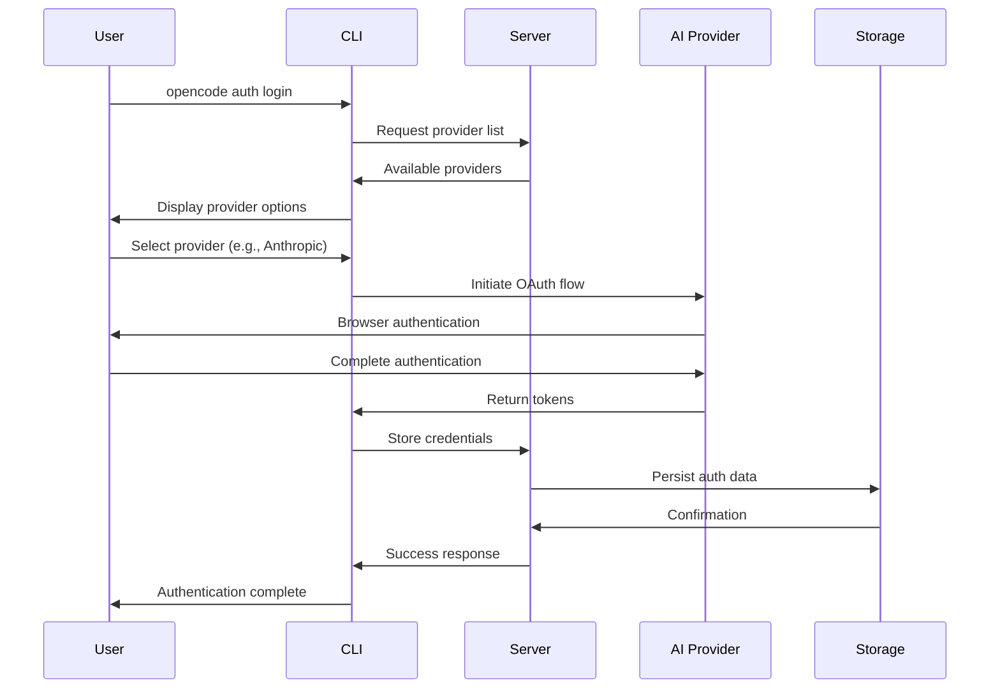

**Key Data Entities**:
- **Auth.Info**: Discriminated union of OAuth, API, and WellKnown auth types
- **Provider.Info**: Provider configuration and capabilities
- **Credentials**: Encrypted storage of authentication tokens

### 2. Session Creation & Project Context

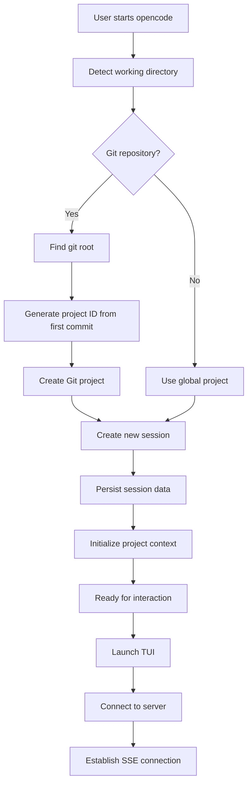

**Data Flow Details**:
```typescript
// Project identification
Project.fromDirectory(directory) → {
  id: string,           // Git commit hash or "global"
  worktree: string,     // Repository root path
  vcs?: "git",          // Version control system
  time: { created: number }
}

// Session creation
Session.create() → {
  id: string,           // ULID identifier
  projectID: string,    // Links to project
  parentID?: string,    // For nested sessions
  title: string,        // Auto-generated or user-provided
  time: { created, updated },
  share?: { url: string }
}
```

### 3. AI Interaction & Tool Execution Workflow

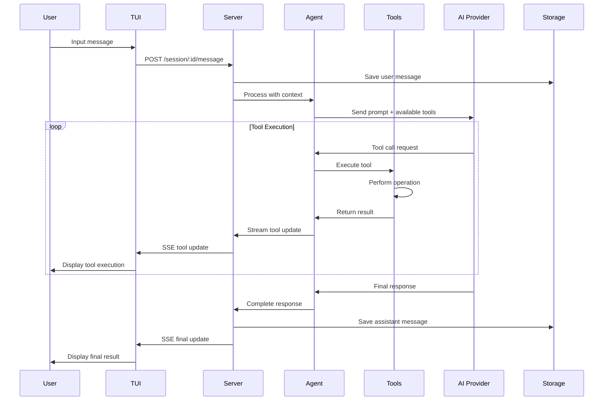

**Tool Execution Pipeline**:
```mermaid
flowchart LR
    INPUT[Tool Input] --> VALIDATE[Validate Schema]
    VALIDATE --> PERMISSION[Check Permissions]
    PERMISSION --> CONTEXT[Setup Context]
    CONTEXT --> EXECUTE[Execute Tool Logic]
    EXECUTE --> METADATA[Generate Metadata]
    METADATA --> OUTPUT[Format Output]
    OUTPUT --> STREAM[Stream to Client]
    STREAM --> PERSIST[Persist Results]
```

---

## 🔧 Core System Workflows

### 4. Tool Registration & Discovery

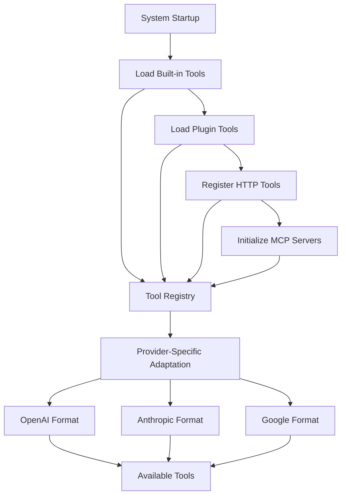

**Tool Registration Process**:
```typescript
// Built-in tools
const BUILTIN = [
  BashTool, EditTool, ReadTool, WriteTool,
  GlobTool, GrepTool, ListTool, PatchTool,
  WebFetchTool, TaskTool, TodoWriteTool, TodoReadTool
]

// Plugin tools (runtime registration)
Plugin.register(toolDefinition)

// HTTP tools (API registration)
Server.registerHttpTool({
  id: "custom-tool",
  description: "Custom tool via HTTP",
  parameters: { /* schema */ },
  callbackUrl: "https://api.example.com/tool"
})

// MCP tools (protocol-based)
MCP.connect("weather", {
  type: "local",
  command: ["opencode", "x", "@h1deya/mcp-server-weather"]
})
```

### 5. File System Operations & Git Integration

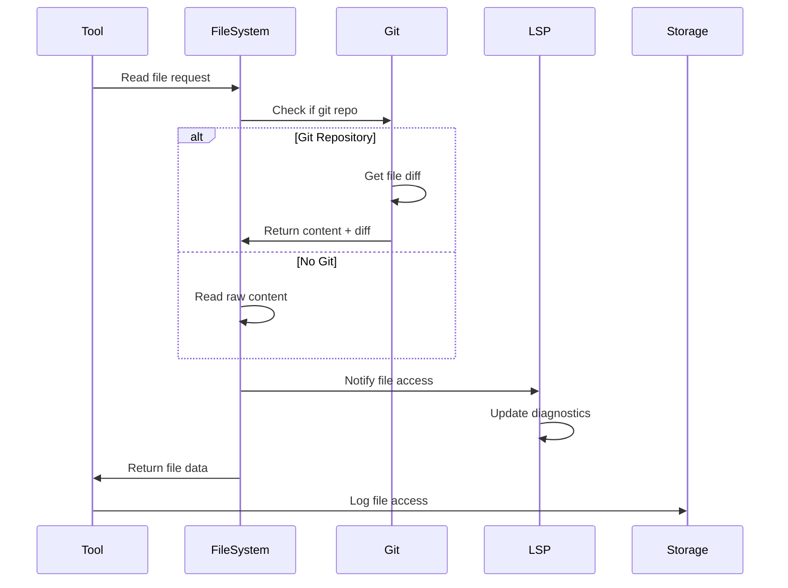

**File Operation Data Flow**:
```typescript
// File read with Git integration
File.read(path) → {
  content: string,      // Current file content
  patch?: string,       // Git diff if available
  diff?: string         // Formatted patch
}

// File write with LSP notification
File.write(path, content) → {
  success: boolean,
  metadata: {
    size: number,
    modified: timestamp,
    lspNotified: boolean
  }
}
```

### 6. LSP Integration & Code Analysis

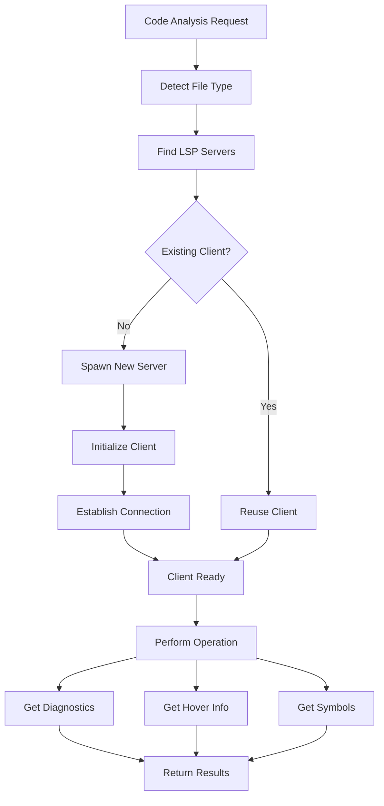

**LSP Client Lifecycle**:
```typescript
// LSP server configuration
{
  "lsp": {
    "typescript": {
      "command": ["typescript-language-server", "--stdio"],
      "extensions": [".ts", ".tsx", ".js", ".jsx"],
      "initialization": { /* LSP init params */ }
    }
  }
}

// Client management
LSP.getClients(file) → LSPClient[]
LSP.touchFile(file) → Promise<void>
LSP.diagnostics() → Record<string, Diagnostic[]>
LSP.hover(position) → HoverInfo
```

---

## 📊 Data Entity Lifecycles

### 7. Session Data Lifecycle

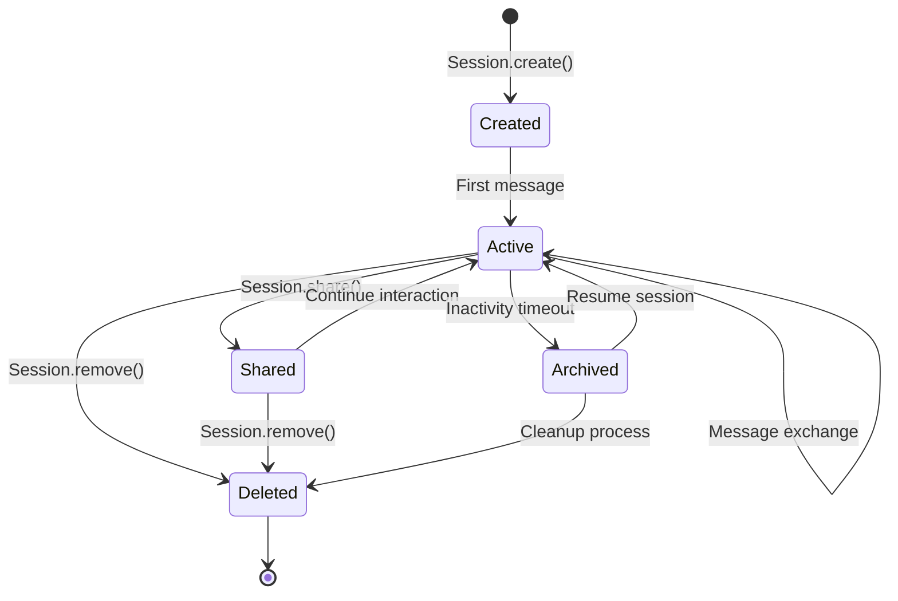

**Session State Transitions**:
```typescript
// Session creation
{
  id: "01HKQR8X9Y2Z3A4B5C6D7E8F9G",
  projectID: "abc123...",
  title: "Fix authentication bug",
  time: { created: 1704067200000, updated: 1704067200000 },
  status: "active"
}

// Session sharing
{
  ...session,
  share: {
    url: "https://opencode.ai/s/9G8F7E6D"
  }
}

// Session archival
{
  ...session,
  status: "archived",
  time: { ...time, archived: 1704153600000 }
}
```

### 8. Message & Part Data Flow

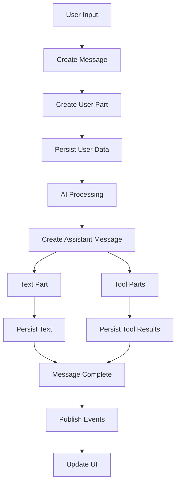

**Message Structure Evolution**:
```typescript
// Initial user message
{
  id: "msg_123",
  sessionID: "session_456",
  role: "user",
  parts: [{
    id: "part_789",
    type: "text",
    text: "Fix this bug in the authentication code"
  }],
  time: { created: timestamp }
}

// Assistant response with tool calls
{
  id: "msg_124",
  sessionID: "session_456",
  role: "assistant",
  parts: [
    {
      id: "part_790",
      type: "text",
      text: "I'll analyze the authentication code and fix the bug."
    },
    {
      id: "part_791",
      type: "tool",
      tool: "read",
      state: {
        status: "completed",
        input: { filePath: "src/auth.ts" },
        output: "// File contents...",
        metadata: { size: 1024 }
      }
    }
  ]
}
```

---

## 🌐 External Integration Workflows

### 9. GitHub Actions Integration

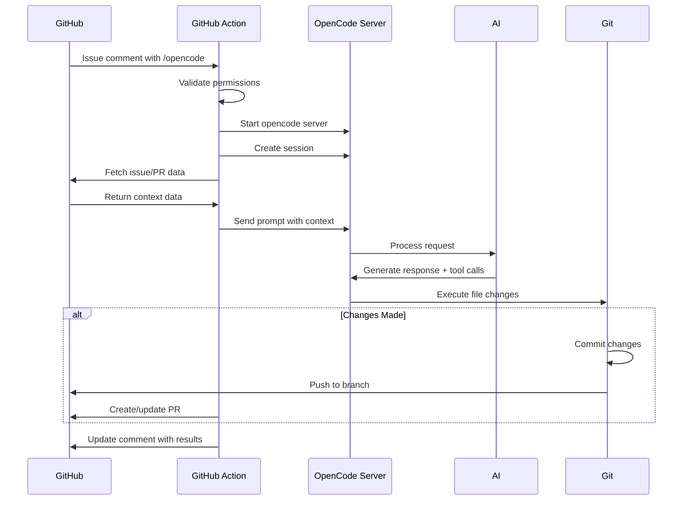

**GitHub Integration Data Flow**:
```typescript
// GitHub context extraction
{
  issue: {
    title: string,
    body: string,
    author: { login: string },
    comments: Comment[]
  },
  pullRequest?: {
    title: string,
    commits: Commit[],
    files: ChangedFile[],
    reviews: Review[]
  }
}

// OpenCode processing
{
  userPrompt: string,           // Extracted from comment
  contextPrompt: string,        // Generated from GitHub data
  promptFiles: AttachedFile[],  // Images/files from comment
  session: Session,             // Created session
  response: string              // AI response
}
```

### 10. Cloud Infrastructure Data Flow

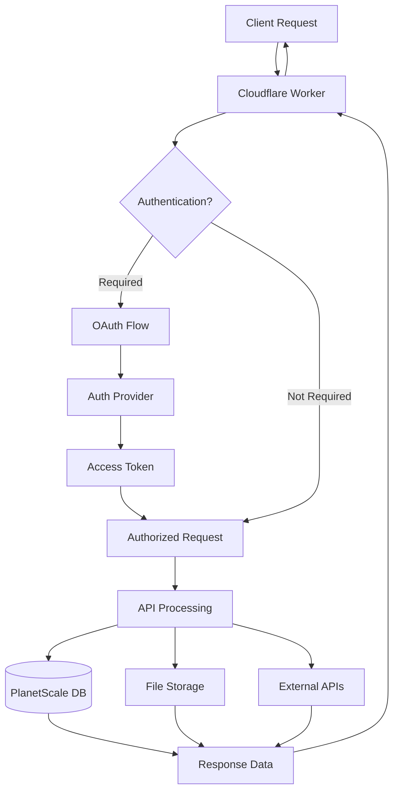

**Cloud Data Architecture**:
```typescript
// Cloudflare Worker environment
{
  database: {
    host: string,
    username: string,
    password: string,
    database: string
  },
  storage: {
    bucket: string,
    region: string
  },
  secrets: {
    anthropicApiKey: string,
    openaiApiKey: string,
    githubAppPrivateKey: string
  }
}
```

---

## 🔄 Event-Driven Architecture

### 11. Event Bus & Real-time Updates

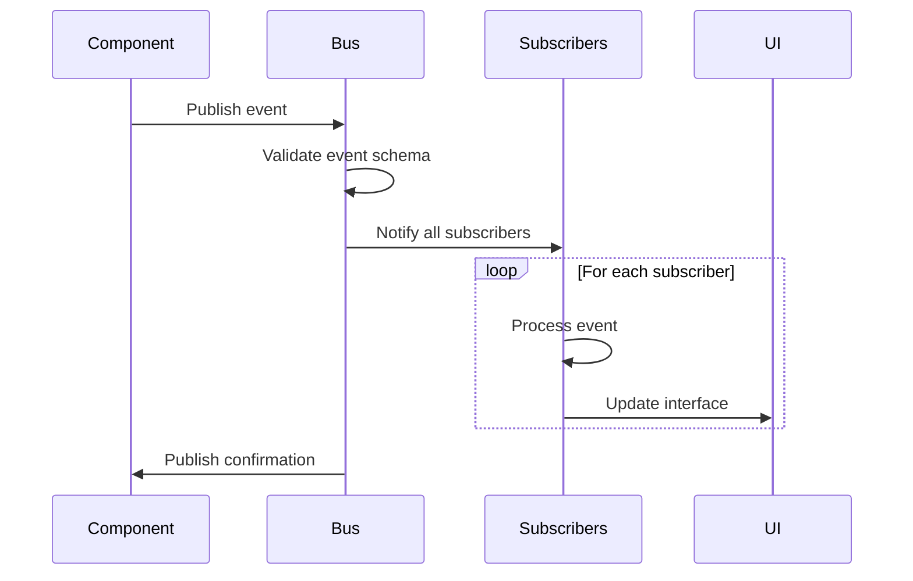

**Event Types & Schemas**:
```typescript
// Session events
const SessionEvents = {
  Created: Bus.event("session.created", z.object({
    info: Session.Info
  })),
  Updated: Bus.event("session.updated", z.object({
    info: Session.Info
  })),
  Deleted: Bus.event("session.deleted", z.object({
    info: Session.Info
  }))
}

// Message events
const MessageEvents = {
  PartUpdated: Bus.event("message.part.updated", z.object({
    part: Part.Info
  }))
}
```

---

## 🎯 Performance & Optimization Workflows

### 12. Caching & Resource Management

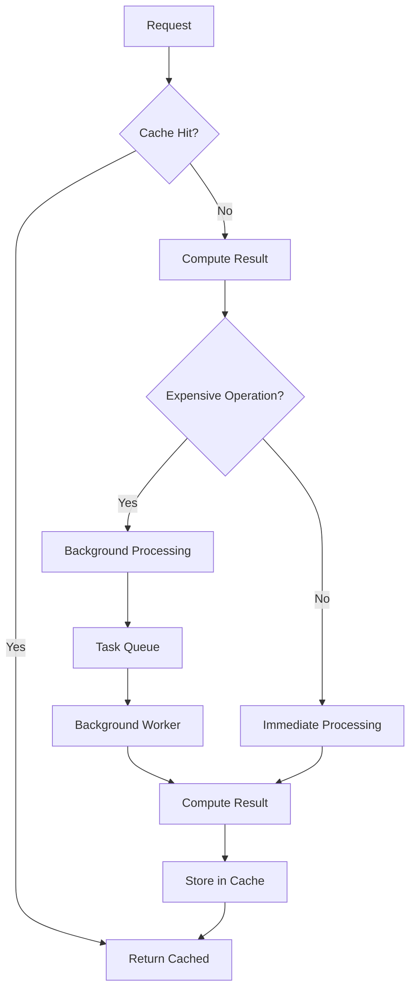

**Caching Strategies**:
```typescript
// Project context caching
const projectCache = new Map<string, Project.Info>()

// LSP client pooling
const lspClients = new Map<string, LSPClient>()

// Tool result memoization
const toolResultCache = new LRUCache<string, ToolResult>({
  max: 1000,
  ttl: 1000 * 60 * 5 // 5 minutes
})
```

---

## 🎯 Key Workflow Insights

### Critical Success Factors

1. **Context Preservation**: Project and session context maintained throughout workflows
2. **Error Recovery**: Graceful handling of failures at each step
3. **Real-time Updates**: Immediate feedback through event-driven architecture
4. **Resource Efficiency**: Intelligent caching and connection pooling
5. **Security Integration**: Permission checks integrated into all workflows

### Performance Characteristics

- **Session Creation**: ~100ms (with Git detection)
- **Tool Execution**: ~200ms average (varies by tool)
- **AI Response**: 2-10s (depends on provider and complexity)
- **File Operations**: ~50ms (with LSP integration)
- **Event Propagation**: ~10ms (real-time updates)

---

*These workflows form the backbone of OpenCode's functionality, enabling seamless integration between AI capabilities and developer tools while maintaining performance and reliability.*
