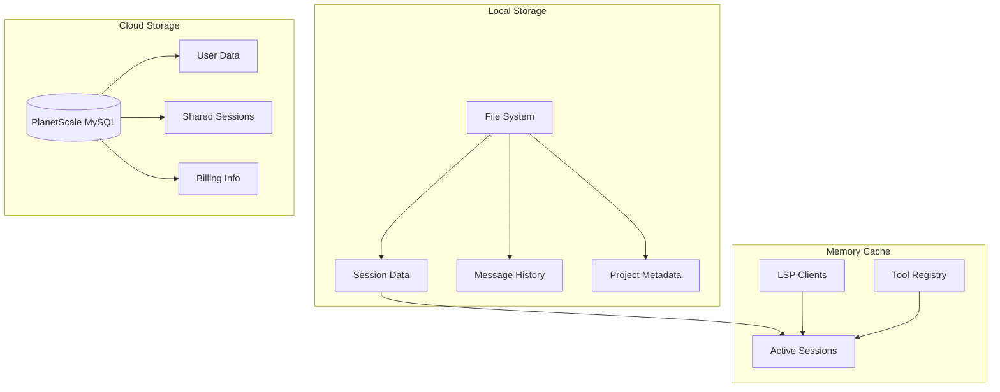
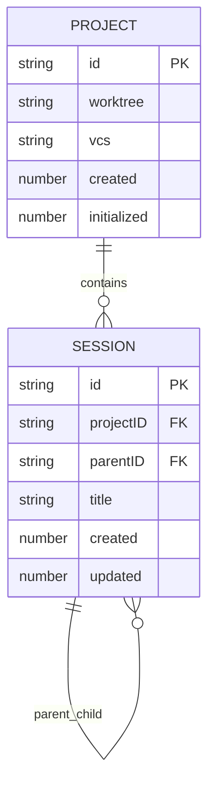
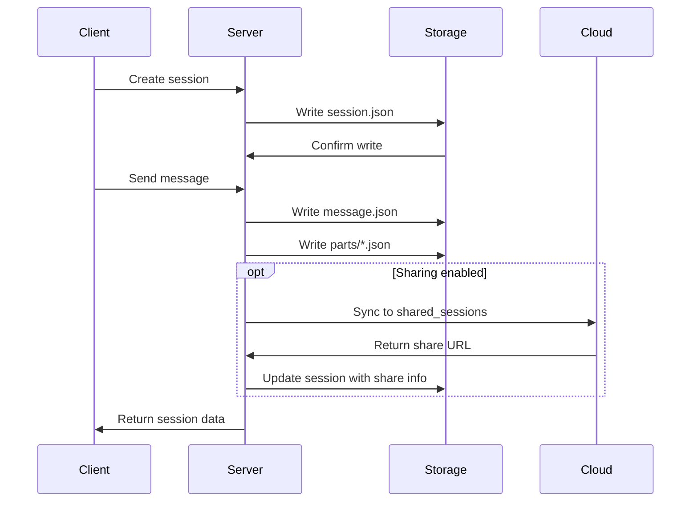

# 🗄️ Data Model & Persistence Architecture

OpenCode employs a sophisticated data architecture that combines file system storage for development data with cloud database storage for user and sharing functionality. This document provides a comprehensive overview of the data model, storage strategies, and persistence patterns.

---

## 🏗️ Storage Architecture Overview

### Hybrid Storage Strategy



**Storage Decision Matrix**:
- **Local File System**: Development data, sessions, messages, project context
- **Cloud Database**: User accounts, shared sessions, billing, analytics
- **Memory Cache**: Active sessions, LSP connections, tool registry

---

## 📊 Core Data Entities

### 1. Project Entity

**Schema Definition**:
```typescript
export const Project.Info = z.object({
  id: z.string(),                    // Git commit hash or "global"
  worktree: z.string(),             // Repository root path
  vcs: z.literal("git").optional(), // Version control system
  time: z.object({
    created: z.number(),            // Creation timestamp
    initialized: z.number().optional() // First session timestamp
  })
})
```

**Storage Location**: `~/.opencode/data/project/{projectId}.json`

**Entity Relationships**:


### 2. Session Entity

**Schema Definition**:
```typescript
export const Session.Info = z.object({
  id: z.string(),                   // ULID identifier
  projectID: z.string(),            // Links to project
  parentID: z.string().optional(), // For nested sessions
  title: z.string(),               // Auto-generated or user-provided
  time: z.object({
    created: z.number(),
    updated: z.number()
  }),
  share: z.object({
    url: z.string()
  }).optional()                    // Sharing information
})
```

**Storage Hierarchy**:
```
~/.opencode/data/
├── session/
│   └── {projectId}/
│       └── {sessionId}.json
├── message/
│   └── {sessionId}/
│       └── {messageId}.json
└── part/
    └── {messageId}/
        └── {partId}.json
```

### 3. Message Entity

**Schema Definition**:
```typescript
export const Message.Info = z.object({
  id: z.string(),                   // ULID identifier
  sessionID: z.string(),            // Parent session
  role: z.enum(["user", "assistant"]),
  time: z.object({
    created: z.number(),
    start: z.number().optional(),   // Processing start
    end: z.number().optional()      // Processing end
  }),
  metadata: z.object({
    user: z.object({
      agent: z.string(),            // Agent used
      modelID: z.string(),          // AI model
      providerID: z.string()        // AI provider
    }).optional(),
    assistant: z.object({
      system: z.string().array(),   // System prompts
      modelID: z.string(),
      providerID: z.string(),
      path: z.object({
        cwd: z.string(),            // Working directory
        root: z.string()            // Project root
      }),
      cost: z.number(),             // Token cost
      tokens: z.object({
        input: z.number(),
        output: z.number(),
        reasoning: z.number(),
        cache: z.object({
          read: z.number(),
          write: z.number()
        })
      })
    }).optional()
  })
})
```

### 4. Part Entity (Message Components)

**Schema Definition**:
```typescript
export const Part.Info = z.discriminatedUnion("type", [
  // Text part
  z.object({
    type: z.literal("text"),
    id: z.string(),
    text: z.string(),
    time: z.object({
      created: z.number(),
      start: z.number().optional(),
      end: z.number().optional()
    }).optional()
  }),
  
  // Tool execution part
  z.object({
    type: z.literal("tool"),
    id: z.string(),
    tool: z.string(),                // Tool name
    state: z.object({
      status: z.enum(["pending", "running", "completed", "failed"]),
      input: z.record(z.any()),      // Tool input parameters
      output: z.string().optional(), // Tool output
      error: z.string().optional(),  // Error message
      metadata: z.record(z.any()).optional() // Tool-specific metadata
    }),
    time: z.object({
      created: z.number(),
      start: z.number().optional(),
      end: z.number().optional()
    }).optional()
  }),
  
  // File attachment part
  z.object({
    type: z.literal("file"),
    id: z.string(),
    filename: z.string(),
    mime: z.string(),
    url: z.string(),                 // Data URL or external URL
    source: z.object({
      type: z.literal("file"),
      path: z.string(),
      text: z.object({
        value: z.string(),
        start: z.number(),
        end: z.number()
      }).optional()
    }).optional()
  })
])
```

---

## 🔧 Tool-Specific Data Models

### 5. Tool Execution Metadata

**Bash Tool Metadata**:
```typescript
{
  command: string,
  description: string,
  exit: number,
  output: string,
  error?: string,
  duration: number,
  cwd: string
}
```

**File Operation Metadata**:
```typescript
{
  path: string,
  size: number,
  modified: number,
  encoding: string,
  lineCount?: number,
  truncated?: boolean
}
```

**LSP Diagnostic Metadata**:
```typescript
{
  diagnostics: Record<string, {
    severity: "error" | "warning" | "info" | "hint",
    message: string,
    range: {
      start: { line: number, character: number },
      end: { line: number, character: number }
    },
    source?: string,
    code?: string
  }[]>
}
```

---

## 🌐 Cloud Database Schema

### 6. User Management (PlanetScale)

**Users Table**:
```sql
CREATE TABLE users (
  id VARCHAR(255) PRIMARY KEY,
  email VARCHAR(255) UNIQUE NOT NULL,
  name VARCHAR(255),
  avatar_url TEXT,
  created_at TIMESTAMP DEFAULT CURRENT_TIMESTAMP,
  updated_at TIMESTAMP DEFAULT CURRENT_TIMESTAMP ON UPDATE CURRENT_TIMESTAMP,
  
  -- Subscription info
  subscription_status ENUM('free', 'pro', 'team') DEFAULT 'free',
  subscription_expires_at TIMESTAMP NULL,
  
  -- Usage tracking
  monthly_tokens_used BIGINT DEFAULT 0,
  monthly_tokens_limit BIGINT DEFAULT 100000,
  
  INDEX idx_email (email),
  INDEX idx_subscription (subscription_status, subscription_expires_at)
);
```

**Shared Sessions Table**:
```sql
CREATE TABLE shared_sessions (
  id VARCHAR(255) PRIMARY KEY,
  user_id VARCHAR(255),
  session_id VARCHAR(255) NOT NULL,
  title VARCHAR(500),
  description TEXT,
  is_public BOOLEAN DEFAULT FALSE,
  view_count INT DEFAULT 0,
  created_at TIMESTAMP DEFAULT CURRENT_TIMESTAMP,
  updated_at TIMESTAMP DEFAULT CURRENT_TIMESTAMP ON UPDATE CURRENT_TIMESTAMP,
  expires_at TIMESTAMP NULL,
  
  FOREIGN KEY (user_id) REFERENCES users(id) ON DELETE CASCADE,
  INDEX idx_user_sessions (user_id, created_at),
  INDEX idx_public_sessions (is_public, created_at),
  INDEX idx_session_id (session_id)
);
```

**Authentication Tokens Table**:
```sql
CREATE TABLE auth_tokens (
  id VARCHAR(255) PRIMARY KEY,
  user_id VARCHAR(255) NOT NULL,
  provider ENUM('anthropic', 'openai', 'google', 'github-copilot') NOT NULL,
  token_type ENUM('oauth', 'api', 'wellknown') NOT NULL,
  encrypted_token TEXT NOT NULL,
  expires_at TIMESTAMP NULL,
  created_at TIMESTAMP DEFAULT CURRENT_TIMESTAMP,
  updated_at TIMESTAMP DEFAULT CURRENT_TIMESTAMP ON UPDATE CURRENT_TIMESTAMP,
  
  FOREIGN KEY (user_id) REFERENCES users(id) ON DELETE CASCADE,
  UNIQUE KEY unique_user_provider (user_id, provider),
  INDEX idx_user_tokens (user_id),
  INDEX idx_expires (expires_at)
);
```

---

## 🔄 Data Flow Patterns

### 7. Session Persistence Flow



### 8. Data Synchronization Strategy

**Local-First Approach**:
```typescript
// All development data stays local
const localPaths = {
  sessions: ["session", projectID, sessionID],
  messages: ["message", sessionID, messageID],
  parts: ["part", messageID, partID],
  projects: ["project", projectID]
}

// Cloud sync only for sharing
const cloudSync = {
  shareSession: async (sessionID: string) => {
    const session = await Storage.read(localPaths.sessions)
    const share = await Cloud.createShare(session)
    await Storage.update(localPaths.sessions, (draft) => {
      draft.share = share
    })
  }
}
```

---

## 🔍 Query Patterns & Indexing

### 9. Local Storage Queries

**Hierarchical Path Queries**:
```typescript
// List all sessions for a project
await Storage.list(["session", projectID])

// Get all messages in a session
await Storage.list(["message", sessionID])

// Find sessions by title pattern
await Storage.search(["session"], {
  filter: (session) => session.title.includes(searchTerm)
})
```

**Performance Optimizations**:
```typescript
// Lazy loading of message parts
const message = await Storage.read(["message", sessionID, messageID])
const parts = await Promise.all(
  message.partIDs.map(partID => 
    Storage.read(["part", messageID, partID])
  )
)

// Caching frequently accessed data
const projectCache = new Map<string, Project.Info>()
const getProject = async (id: string) => {
  if (projectCache.has(id)) return projectCache.get(id)
  const project = await Storage.read(["project", id])
  projectCache.set(id, project)
  return project
}
```

### 10. Cloud Database Queries

**Optimized Query Patterns**:
```sql
-- Get user's recent shared sessions
SELECT s.*, u.name as user_name
FROM shared_sessions s
JOIN users u ON s.user_id = u.id
WHERE s.user_id = ? 
ORDER BY s.updated_at DESC
LIMIT 20;

-- Find popular public sessions
SELECT s.*, u.name as user_name
FROM shared_sessions s
JOIN users u ON s.user_id = u.id
WHERE s.is_public = TRUE
ORDER BY s.view_count DESC, s.created_at DESC
LIMIT 50;

-- Check user token usage
SELECT 
  monthly_tokens_used,
  monthly_tokens_limit,
  (monthly_tokens_used / monthly_tokens_limit * 100) as usage_percentage
FROM users
WHERE id = ?;
```

---

## 🔒 Data Security & Privacy

### 11. Encryption & Security

**Local Data Protection**:
```typescript
// Authentication data encryption
const authFilePath = path.join(Global.Path.data, "auth.json")
await fs.chmod(authFilePath, 0o600) // Owner read/write only

// Sensitive data handling
const encryptSensitiveData = (data: any) => {
  return crypto.encrypt(JSON.stringify(data), userKey)
}
```

**Cloud Data Security**:
```sql
-- Encrypted token storage
INSERT INTO auth_tokens (
  user_id, 
  provider, 
  encrypted_token
) VALUES (
  ?, 
  ?, 
  AES_ENCRYPT(?, ?)
);

-- Secure token retrieval
SELECT 
  AES_DECRYPT(encrypted_token, ?) as decrypted_token
FROM auth_tokens
WHERE user_id = ? AND provider = ?;
```

### 12. Data Retention Policies

**Local Data Cleanup**:
```typescript
// Automatic cleanup of old sessions
const cleanupOldSessions = async () => {
  const cutoffDate = Date.now() - (90 * 24 * 60 * 60 * 1000) // 90 days
  
  const sessions = await Storage.list(["session"])
  for (const sessionPath of sessions) {
    const session = await Storage.read(sessionPath)
    if (session.time.updated < cutoffDate) {
      await Session.remove(session.id)
    }
  }
}
```

**Cloud Data Retention**:
```sql
-- Clean up expired shared sessions
DELETE FROM shared_sessions
WHERE expires_at IS NOT NULL 
  AND expires_at < NOW();

-- Archive old user data
UPDATE users 
SET archived_at = NOW()
WHERE last_login_at < DATE_SUB(NOW(), INTERVAL 1 YEAR);
```

---

## 📊 Data Analytics & Monitoring

### 13. Usage Tracking

**Local Metrics**:
```typescript
const metrics = {
  sessionsCreated: number,
  messagesProcessed: number,
  toolsExecuted: Record<string, number>,
  tokensUsed: number,
  averageResponseTime: number
}
```

**Cloud Analytics**:
```sql
-- Daily active users
SELECT DATE(created_at) as date, COUNT(DISTINCT user_id) as dau
FROM shared_sessions
WHERE created_at >= DATE_SUB(NOW(), INTERVAL 30 DAY)
GROUP BY DATE(created_at);

-- Popular tools usage
SELECT 
  JSON_EXTRACT(metadata, '$.tool') as tool_name,
  COUNT(*) as usage_count
FROM message_parts
WHERE type = 'tool'
GROUP BY tool_name
ORDER BY usage_count DESC;
```

---

## 🎯 Data Model Evolution

### 14. Schema Migration Strategy

**Version Management**:
```typescript
const SCHEMA_VERSION = "1.2.0"

const migrations = {
  "1.1.0": async () => {
    // Add share field to sessions
    const sessions = await Storage.list(["session"])
    for (const sessionPath of sessions) {
      await Storage.update(sessionPath, (draft) => {
        if (!draft.share) draft.share = undefined
      })
    }
  },
  
  "1.2.0": async () => {
    // Add metadata to messages
    const messages = await Storage.list(["message"])
    for (const messagePath of messages) {
      await Storage.update(messagePath, (draft) => {
        if (!draft.metadata) draft.metadata = {}
      })
    }
  }
}
```

**Backward Compatibility**:
```typescript
const readWithMigration = async <T>(path: string[]): Promise<T> => {
  const data = await Storage.read(path)
  const currentVersion = data.schemaVersion || "1.0.0"
  
  if (currentVersion !== SCHEMA_VERSION) {
    return await migrateData(data, currentVersion, SCHEMA_VERSION)
  }
  
  return data
}
```

---

*This data model provides a robust foundation for OpenCode's functionality while maintaining flexibility for future enhancements and ensuring data integrity across local and cloud storage systems.*
