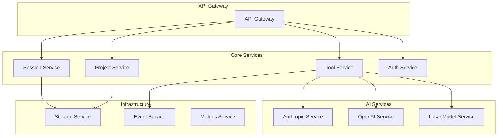

# 🔄 Refactoring Suggestions - Code Quality Improvements

This document outlines architectural improvements, code quality enhancements, and refactoring opportunities to make OpenCode more maintainable, performant, and extensible.

---

## 🎯 Refactoring Overview

### Assessment Criteria

**Code Quality Metrics**:
- **Maintainability**: How easy is it to modify and extend
- **Performance**: Runtime efficiency and resource usage
- **Testability**: How well the code supports automated testing
- **Readability**: Code clarity and documentation quality
- **Modularity**: Component separation and reusability

### Priority Classification

- 🔴 **Critical**: Architectural issues that limit scalability
- 🟠 **High**: Code quality issues affecting maintainability
- 🟡 **Medium**: Performance optimizations and cleanup
- 🟢 **Low**: Style improvements and minor refactoring
- 🚀 **Future**: Long-term architectural evolution

---

## 🔴 Critical Architectural Refactoring

### 1. Storage Layer Abstraction - 🔴 Critical

**Current Issue**: Direct file system operations scattered throughout codebase

**Problem Analysis**:
```typescript
// Current: Direct file operations in multiple places
await Bun.write(file, JSON.stringify(data))
const content = await Bun.file(path).text()
await fs.chmod(file.name!, 0o600)
```

**Proposed Solution**: Unified Storage Interface
```typescript
interface StorageProvider {
  read<T>(path: string[]): Promise<T>
  write<T>(path: string[], data: T): Promise<void>
  exists(path: string[]): Promise<boolean>
  list(path: string[]): Promise<string[]>
  remove(path: string[]): Promise<void>
  watch(path: string[], callback: (event: StorageEvent) => void): Promise<() => void>
}

class FileSystemStorage implements StorageProvider {
  private basePath: string
  private encryption?: EncryptionProvider
  
  async read<T>(path: string[]): Promise<T> {
    const fullPath = this.resolvePath(path)
    await this.validateAccess(fullPath)
    
    const content = await Bun.file(fullPath).text()
    const data = JSON.parse(content)
    
    return this.encryption ? this.encryption.decrypt(data) : data
  }
  
  async write<T>(path: string[], data: T): Promise<void> {
    const fullPath = this.resolvePath(path)
    await this.ensureDirectory(path.dirname(fullPath))
    
    const content = this.encryption ? this.encryption.encrypt(data) : data
    await Bun.write(fullPath, JSON.stringify(content, null, 2))
    await fs.chmod(fullPath, 0o600)
  }
}

// Usage throughout codebase
const storage = new FileSystemStorage(Global.Path.data)
const session = await storage.read<Session.Info>(["session", projectId, sessionId])
```

**Benefits**:
- Centralized storage logic
- Easy to add encryption, compression, or cloud storage
- Consistent error handling and validation
- Better testability with mock storage providers

### 2. Event System Refactoring - 🔴 Critical

**Current Issue**: Tightly coupled event handling with global Bus

**Problem Analysis**:
```typescript
// Current: Global event bus with string-based events
Bus.publish("tool.executed", { toolId, result })
Bus.subscribe((event) => { /* handle all events */ })
```

**Proposed Solution**: Typed Event System
```typescript
// Define event types
interface EventMap {
  'tool.started': { toolId: string; sessionId: string; args: any }
  'tool.completed': { toolId: string; sessionId: string; result: any; duration: number }
  'tool.failed': { toolId: string; sessionId: string; error: Error }
  'session.created': { sessionId: string; projectId: string }
  'session.updated': { sessionId: string; changes: Partial<Session.Info> }
  'message.added': { sessionId: string; messageId: string; message: Message.Info }
}

class TypedEventBus {
  private listeners = new Map<keyof EventMap, Set<Function>>()
  
  on<K extends keyof EventMap>(
    event: K,
    listener: (data: EventMap[K]) => void | Promise<void>
  ): () => void {
    if (!this.listeners.has(event)) {
      this.listeners.set(event, new Set())
    }
    this.listeners.get(event)!.add(listener)
    
    return () => this.listeners.get(event)?.delete(listener)
  }
  
  emit<K extends keyof EventMap>(event: K, data: EventMap[K]): void {
    const listeners = this.listeners.get(event)
    if (listeners) {
      for (const listener of listeners) {
        try {
          listener(data)
        } catch (error) {
          console.error(`Event listener error for ${event}:`, error)
        }
      }
    }
  }
}

// Usage
const eventBus = new TypedEventBus()

eventBus.on('tool.completed', ({ toolId, result, duration }) => {
  metrics.record('tool.execution', { toolId, duration, success: true })
})
```

### 3. Dependency Injection Container - 🔴 Critical

**Current Issue**: Context provision pattern is limited and hard to test

**Problem Analysis**:
```typescript
// Current: Global Instance with limited context
return Instance.provide(directory, async () => {
  return next()
})
```

**Proposed Solution**: Proper DI Container
```typescript
interface ServiceContainer {
  register<T>(token: ServiceToken<T>, factory: ServiceFactory<T>): void
  resolve<T>(token: ServiceToken<T>): T
  createScope(): ServiceContainer
}

class DIContainer implements ServiceContainer {
  private services = new Map<ServiceToken<any>, ServiceFactory<any>>()
  private instances = new Map<ServiceToken<any>, any>()
  
  register<T>(token: ServiceToken<T>, factory: ServiceFactory<T>): void {
    this.services.set(token, factory)
  }
  
  resolve<T>(token: ServiceToken<T>): T {
    if (this.instances.has(token)) {
      return this.instances.get(token)
    }
    
    const factory = this.services.get(token)
    if (!factory) {
      throw new Error(`Service not registered: ${token.name}`)
    }
    
    const instance = factory(this)
    this.instances.set(token, instance)
    return instance
  }
}

// Service tokens
const STORAGE = createToken<StorageProvider>('Storage')
const EVENT_BUS = createToken<TypedEventBus>('EventBus')
const PROJECT_SERVICE = createToken<ProjectService>('ProjectService')

// Registration
container.register(STORAGE, () => new FileSystemStorage(Global.Path.data))
container.register(EVENT_BUS, () => new TypedEventBus())
container.register(PROJECT_SERVICE, (c) => new ProjectService(
  c.resolve(STORAGE),
  c.resolve(EVENT_BUS)
))
```

---

## 🟠 High Priority Code Quality

### 4. Tool System Type Safety - 🟠 High

**Current Issue**: Tool parameters and results lack comprehensive type safety

**Problem Analysis**:
```typescript
// Current: Loose typing in tool execution
const result = await tool.execute(args, ctx)
// result.metadata could be anything
```

**Proposed Solution**: Strongly Typed Tool System
```typescript
interface TypedTool<TParams, TMetadata, TResult = string> {
  id: string
  schema: z.ZodSchema<TParams>
  execute(
    params: TParams,
    ctx: ToolContext
  ): Promise<ToolResult<TMetadata, TResult>>
}

interface ToolResult<TMetadata, TResult = string> {
  title: string
  metadata: TMetadata
  output: TResult
  status: 'success' | 'error' | 'warning'
}

// Example: Strongly typed bash tool
interface BashParams {
  command: string
  timeout?: number
  description: string
}

interface BashMetadata {
  command: string
  exitCode: number
  duration: number
  cwd: string
}

const BashTool: TypedTool<BashParams, BashMetadata> = {
  id: 'bash',
  schema: z.object({
    command: z.string(),
    timeout: z.number().optional(),
    description: z.string()
  }),
  
  async execute(params, ctx): Promise<ToolResult<BashMetadata>> {
    // Implementation with full type safety
    const start = Date.now()
    const result = await executeBashCommand(params.command)
    
    return {
      title: params.description,
      metadata: {
        command: params.command,
        exitCode: result.exitCode,
        duration: Date.now() - start,
        cwd: ctx.workingDirectory
      },
      output: result.stdout,
      status: result.exitCode === 0 ? 'success' : 'error'
    }
  }
}
```

### 5. Error Handling Standardization - 🟠 High

**Current Issue**: Inconsistent error handling patterns across components

**Problem Analysis**:
```typescript
// Current: Mixed error handling approaches
throw new Error("Something went wrong")
throw new NamedError.ValidationError({ message: "Invalid input" })
return { error: "Failed to process" }
```

**Proposed Solution**: Unified Error System
```typescript
// Base error types
abstract class OpenCodeError extends Error {
  abstract readonly code: string
  abstract readonly category: 'user' | 'system' | 'external'
  abstract readonly severity: 'low' | 'medium' | 'high' | 'critical'
  
  constructor(
    message: string,
    public readonly context?: Record<string, any>
  ) {
    super(message)
    this.name = this.constructor.name
  }
  
  toJSON() {
    return {
      name: this.name,
      code: this.code,
      message: this.message,
      category: this.category,
      severity: this.severity,
      context: this.context
    }
  }
}

// Specific error types
class ValidationError extends OpenCodeError {
  readonly code = 'VALIDATION_ERROR'
  readonly category = 'user' as const
  readonly severity = 'medium' as const
}

class ToolExecutionError extends OpenCodeError {
  readonly code = 'TOOL_EXECUTION_ERROR'
  readonly category = 'system' as const
  readonly severity = 'high' as const
}

class ExternalServiceError extends OpenCodeError {
  readonly code = 'EXTERNAL_SERVICE_ERROR'
  readonly category = 'external' as const
  readonly severity = 'medium' as const
}

// Result type for operations that can fail
type Result<T, E = OpenCodeError> = 
  | { success: true; data: T }
  | { success: false; error: E }

// Usage
async function executeToolSafely<T>(
  tool: Tool,
  params: any
): Promise<Result<T, ToolExecutionError>> {
  try {
    const result = await tool.execute(params)
    return { success: true, data: result }
  } catch (error) {
    return {
      success: false,
      error: new ToolExecutionError(
        `Tool execution failed: ${error.message}`,
        { toolId: tool.id, params }
      )
    }
  }
}
```

### 6. Configuration Management Refactoring - 🟠 High

**Current Issue**: Configuration scattered across multiple files and formats

**Proposed Solution**: Centralized Configuration System
```typescript
interface OpenCodeConfig {
  model: {
    provider: string
    model: string
    temperature?: number
    maxTokens?: number
  }
  permissions: {
    edit: PermissionLevel
    bash: Record<string, PermissionLevel>
    webfetch: PermissionLevel
  }
  lsp: Record<string, LSPConfig>
  mcp: Record<string, MCPConfig>
  ui: {
    theme: 'light' | 'dark' | 'auto'
    language: string
    animations: boolean
  }
  storage: {
    encryption: boolean
    compression: boolean
    retentionDays: number
  }
}

class ConfigManager {
  private config: OpenCodeConfig
  private watchers = new Set<(config: OpenCodeConfig) => void>()
  
  constructor(private configPath: string) {
    this.config = this.loadConfig()
    this.watchConfigFile()
  }
  
  get<K extends keyof OpenCodeConfig>(key: K): OpenCodeConfig[K] {
    return this.config[key]
  }
  
  set<K extends keyof OpenCodeConfig>(
    key: K,
    value: OpenCodeConfig[K]
  ): void {
    this.config[key] = value
    this.saveConfig()
    this.notifyWatchers()
  }
  
  onChange(callback: (config: OpenCodeConfig) => void): () => void {
    this.watchers.add(callback)
    return () => this.watchers.delete(callback)
  }
}
```

---

## 🟡 Medium Priority Optimizations

### 7. Performance Optimizations - 🟡 Medium

**Memory Usage Optimization**:
```typescript
// Current: Loading entire files into memory
const content = await Bun.file(path).text()

// Proposed: Streaming for large files
class StreamingFileReader {
  async readInChunks(
    path: string,
    chunkSize: number = 64 * 1024
  ): AsyncGenerator<string> {
    const file = Bun.file(path)
    const stream = file.stream()
    const reader = stream.getReader()
    
    try {
      while (true) {
        const { done, value } = await reader.read()
        if (done) break
        
        yield new TextDecoder().decode(value)
      }
    } finally {
      reader.releaseLock()
    }
  }
}
```

**Caching Strategy**:
```typescript
class CacheManager<T> {
  private cache = new Map<string, { data: T; expires: number }>()
  
  set(key: string, data: T, ttlMs: number): void {
    this.cache.set(key, {
      data,
      expires: Date.now() + ttlMs
    })
  }
  
  get(key: string): T | undefined {
    const entry = this.cache.get(key)
    if (!entry) return undefined
    
    if (Date.now() > entry.expires) {
      this.cache.delete(key)
      return undefined
    }
    
    return entry.data
  }
  
  clear(): void {
    this.cache.clear()
  }
}
```

### 8. Code Organization Improvements - 🟡 Medium

**Module Structure Refactoring**:
```
packages/opencode/src/
├── core/                 # Core business logic
│   ├── session/         # Session management
│   ├── project/         # Project detection and management
│   ├── storage/         # Storage abstraction
│   └── events/          # Event system
├── tools/               # Tool implementations
│   ├── base/           # Base tool classes
│   ├── filesystem/     # File operation tools
│   ├── execution/      # Command execution tools
│   └── analysis/       # Code analysis tools
├── providers/           # AI provider integrations
│   ├── anthropic/
│   ├── openai/
│   └── google/
├── infrastructure/      # Infrastructure concerns
│   ├── auth/           # Authentication
│   ├── config/         # Configuration management
│   ├── logging/        # Logging system
│   └── monitoring/     # Metrics and monitoring
└── api/                # API layer
    ├── routes/         # Route handlers
    ├── middleware/     # Middleware
    └── validation/     # Input validation
```

### 9. Testing Infrastructure - 🟡 Medium

**Comprehensive Test Strategy**:
```typescript
// Unit tests for tools
describe('BashTool', () => {
  let tool: BashTool
  let mockContext: ToolContext
  
  beforeEach(() => {
    tool = new BashTool()
    mockContext = createMockContext()
  })
  
  it('should execute simple commands', async () => {
    const result = await tool.execute({
      command: 'echo "hello"',
      description: 'Test echo'
    }, mockContext)
    
    expect(result.output).toBe('hello\n')
    expect(result.metadata.exitCode).toBe(0)
  })
  
  it('should handle command failures', async () => {
    const result = await tool.execute({
      command: 'exit 1',
      description: 'Test failure'
    }, mockContext)
    
    expect(result.status).toBe('error')
    expect(result.metadata.exitCode).toBe(1)
  })
})

// Integration tests
describe('Session Management', () => {
  let sessionService: SessionService
  let storage: MockStorage
  
  beforeEach(() => {
    storage = new MockStorage()
    sessionService = new SessionService(storage)
  })
  
  it('should create and retrieve sessions', async () => {
    const session = await sessionService.create({
      title: 'Test Session'
    })
    
    const retrieved = await sessionService.get(session.id)
    expect(retrieved).toEqual(session)
  })
})
```

---

## 🟢 Low Priority Improvements

### 10. Code Style Consistency - 🟢 Low

**Linting and Formatting**:
```json
// .eslintrc.json
{
  "extends": [
    "@typescript-eslint/recommended",
    "prettier"
  ],
  "rules": {
    "prefer-const": "error",
    "no-var": "error",
    "@typescript-eslint/no-unused-vars": "error",
    "@typescript-eslint/explicit-function-return-type": "warn"
  }
}

// prettier.config.js
module.exports = {
  semi: false,
  singleQuote: true,
  trailingComma: 'es5',
  tabWidth: 2,
  printWidth: 100
}
```

### 11. Documentation Improvements - 🟢 Low

**Inline Documentation**:
```typescript
/**
 * Executes a tool with the given parameters and context.
 * 
 * @param tool - The tool to execute
 * @param params - Parameters for the tool execution
 * @param context - Execution context including session and user info
 * @returns Promise resolving to the tool execution result
 * 
 * @throws {ValidationError} When parameters don't match tool schema
 * @throws {PermissionError} When user lacks required permissions
 * @throws {ToolExecutionError} When tool execution fails
 * 
 * @example
 * ```typescript
 * const result = await executeTool(bashTool, {
 *   command: 'ls -la',
 *   description: 'List files'
 * }, context)
 * ```
 */
async function executeTool<T>(
  tool: Tool<T>,
  params: T,
  context: ToolContext
): Promise<ToolResult> {
  // Implementation
}
```

---

## 🚀 Future Architectural Evolution

### 12. Microservices Architecture - 🚀 Future

**Long-term Vision**: Split monolithic server into specialized services



### 13. Plugin Architecture - 🚀 Future

**Extensible Plugin System**:
```typescript
interface Plugin {
  name: string
  version: string
  dependencies: string[]
  
  activate(context: PluginContext): Promise<void>
  deactivate(): Promise<void>
}

interface PluginContext {
  registerTool(tool: Tool): void
  registerCommand(command: Command): void
  registerProvider(provider: AIProvider): void
  
  storage: StorageProvider
  events: EventBus
  config: ConfigManager
}

class PluginManager {
  private plugins = new Map<string, Plugin>()
  
  async loadPlugin(path: string): Promise<void> {
    const plugin = await import(path)
    await this.validatePlugin(plugin)
    
    this.plugins.set(plugin.name, plugin)
    await plugin.activate(this.createContext())
  }
}
```

---

## 📊 Refactoring Roadmap

### Phase 1: Foundation (Months 1-2)
- [ ] Storage layer abstraction
- [ ] Event system refactoring
- [ ] Error handling standardization
- [ ] Basic dependency injection

### Phase 2: Quality (Months 3-4)
- [ ] Tool system type safety
- [ ] Configuration management
- [ ] Performance optimizations
- [ ] Testing infrastructure

### Phase 3: Organization (Months 5-6)
- [ ] Code organization improvements
- [ ] Documentation enhancements
- [ ] Code style consistency
- [ ] Monitoring and observability

### Phase 4: Evolution (Months 7+)
- [ ] Plugin architecture
- [ ] Microservices evaluation
- [ ] Advanced caching strategies
- [ ] Performance monitoring

---

## 🎯 Implementation Guidelines

### Refactoring Best Practices

1. **Incremental Changes**: Make small, focused changes
2. **Backward Compatibility**: Maintain API compatibility during transitions
3. **Test Coverage**: Ensure comprehensive test coverage before refactoring
4. **Documentation**: Update documentation with each change
5. **Performance Monitoring**: Monitor performance impact of changes

### Risk Mitigation

1. **Feature Flags**: Use feature flags for major changes
2. **Rollback Plans**: Have clear rollback procedures
3. **Staging Environment**: Test all changes in staging first
4. **User Communication**: Communicate breaking changes clearly
5. **Gradual Rollout**: Roll out changes gradually to users

---

*This refactoring guide provides a structured approach to improving OpenCode's architecture and code quality while maintaining stability and user experience.*
